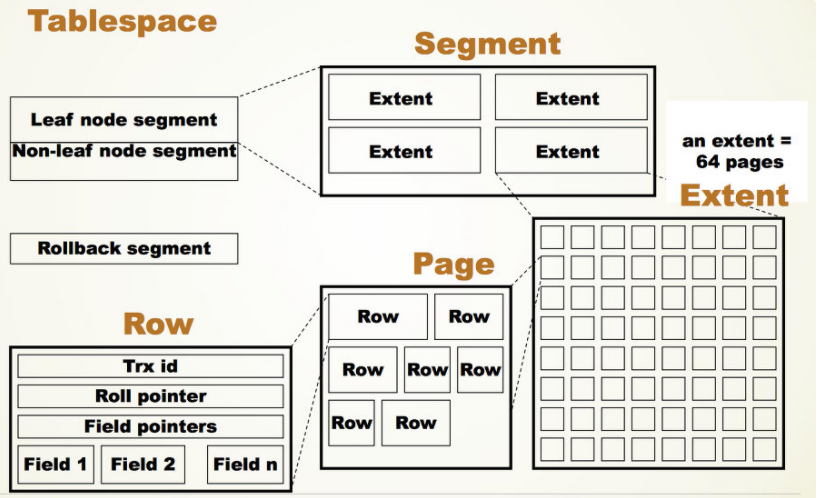

### .ibd文件

- 数据库中表数据的**物理存储**文件
- innodb_file_per_table=true，每个表一个单独存储一个.ibd文件
- innodb_file_per_table=false，所有Table的数据放入同一个.ibd文件中，这样有问题：在多表场景中，在删除表之后回收空间等操作中会带来很大的不便

### TableSpace（表空间）

可以理解成为.ibd文件的逻辑描述

### .ibd文件结构

.ibd文件为了把一定数量的Page整合为一个Extent，默认是64个16KB（page大小的默认值）的Page（共1M），而多个Extent又构成了一个Segment，默认一个Tablespace的文件结构如图所示：

其中，Segment可以简单理解为是一个逻辑的概念，在每个Tablespace创建之初，就会初始化两个Segment，其中Leaf node
segment可以理解为InnoDB中的INode，而Extent是一个物理概念，每次Btree的扩容都是以Extent为单位来扩容的，默认一次扩容不超过4个Extent。

### .ibd文件中的page0、page1、page2、page3

#### page0

- .ibd文件中的第一个page，表空间创建的时候进行初始化
- 跟踪后续256个Extent（约256M）的空间管理，所以每隔256M空间大小就需要创建相仿于Page0的Page

### InnoDB内存中对.ibd文件的管理

- 在innodb_file_per_table为ON的情况下，当用户创建一个表时，实际就会在datadir目录下创建一个对应的.ibd文件
- 在InnoDB启动时
    - 扫描datadir目录中所有的ibd文件
    - 解析page0~3，读取space_id
    - 根据文件名和space_id获取到表空间的映射关系，这样就可以通过space_id找到对应的ibd文件
    - 保存映射关系到InnoDB的Fil_system这个对象中
- 在InnoDB crash recovery时
    - 根据log record找到space_id，去到InnoDB的Fil_system这个对象中找到对应的ibd文件
    - 根据page_no去ibd文件中读取对应的page，并应用对应的redo，恢复数据库到crash的那一刻