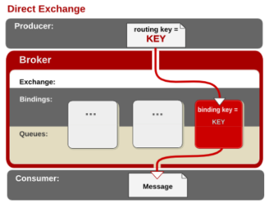

## RabbitMQ架构

### 介绍

- ​	erlang语言开发的AMQP的开源实现

### AMQP

-  Advanced Message Queue Protocol，高级消息队列
- 应用层协议，面向消息

### 特点

- 可靠性： RabbitMQ 使用一些机制来保证可靠性，如持久化、传输确认、发布确认 
- 灵活的路由：在消息进入队列之前，通过 Exchange 来路由消息的。对于典型的路由功能，RabbitMQ 已经提供了一些内置的 Exchange 来实现。针对更复杂的路由功能，可以将多个 Exchange 绑定在一起，也通过插件机制实现自己的 Exchange 
- 消息集群： 多个 RabbitMQ 服务器可以组成一个集群，形成一个逻辑 Broker  
- 高可用： 队列可以在集群中的机器上进行镜像，使得在部分节点出问题的情况下队列仍然可用 
- 多种协议： RabbitMQ 支持多种消息队列协议，比如 STOMP、MQTT 等等 
- 多语言客户端： RabbitMQ 几乎支持所有常用语言，比如 Java、.NET、Ruby 等等 
- 管理界面： RabbitMQ 提供了一个易用的用户界面，使得用户可以监控和管理消息 Broker 的许多方面 
- 跟踪机制： 如果消息异常，RabbitMQ 提供了消息跟踪机制，使用者可以找出发生了什么 
- 插件机制： RabbitMQ 提供了许多插件，来从多方面进行扩展，也可以编写自己的插件 

### 基本概念

- Message：**消息**，消息是不具名的，它由消息头和消息体组成。消息体是不透明的，而**消息头则由一系列的可选属性组成，这些属性包括routing-key（路由键）、priority（相对于其他消息的优先权）、delivery-mode（指出该消息可能需要持久性存储）等**

- Publisher： **消息的生产者** 
- Exchange： **交换器**，用来接收生产者发送的消息并将这些消息路由给服务器中的队列
- Binding： **绑定**，用于消息队列和交换器之间的关联。一个绑定就是**基于路由键**将交换器和消息队列连接起来的**路由规则**，所以可以将交换器理解成一个**由绑定构成的路由表**
- Queue： **消息队列**，用来保存消息直到发送给消费者。它是消息的容器，也是消息的终点
- Connection： **网络连接**，比如一个TCP连接
- Channel：**信道**，多路复用连接中的一条独立的双向数据流通道。信道是建立在真实的TCP连接内地虚拟连接，AMQP 命令都是通过信道发出去的，不管是发布消息、订阅队列还是接收消息，这些动作都是通过信道完成。因为对于操作系统来说建立和销毁 TCP 都是非常昂贵的开销，所以引入了信道的概念，以复用一条 TCP 连接
- Consumer： **消息的消费者** 
- Virtual Host ：**虚拟主机**，表示一批交换器、消息队列和相关对象。虚拟主机是共享相同的身份认证和加密环境的独立服务器域。每个 vhost 本质上就是一个 mini 版的 RabbitMQ 服务器，拥有自己的队列、交换器、绑定和权限机制。vhost 是 AMQP 概念的基础，必须在连接时指定，RabbitMQ 默认的 vhost 是 /
- Broker： **消息队列服务器实体** 

### AMQP 中的消息路由

 Exchange分发消息时根据类型的不同分发策略有区别，目前共四种类型：direct、fanout、topic、headers 

#### direct

- 消息中的（routing key）路由键和binding中的绑定的路由键一致，交换机将消息发送到对应的队列中

#### fanout

- 不处理路由键
- 消息发送到绑定到交换机上的队列
- 转发消息是最快的

#### topic

- topic 交换器通过模式匹配分配消息的路由键属性，将路由键和某个模式进行匹配，此时队列需要绑定到一个模式上。它将路由键和绑定键的字符串切分成单词，这些单词之间用点隔开。它同样也会识别两个通配符：符号“#”和符号“*”。#匹配0个或多个单词，*匹配不多不少一个单词

#### headers 

-  headers 匹配 AMQP 消息的 header 而不是路由键，此外 headers 交换器和 direct 交换器完全一致，但性能差很多 